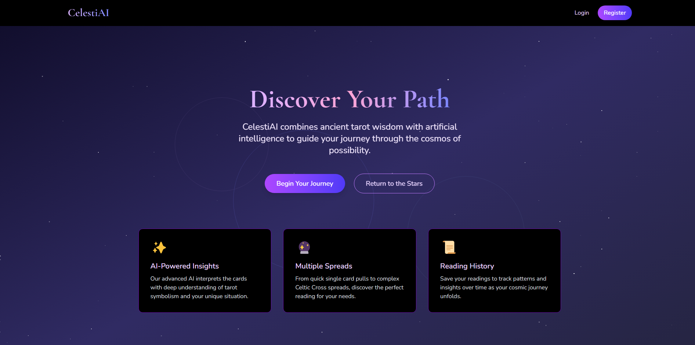

# 🔮 *✧･ﾟ AI-Powered Tarot Reading Web App ･ﾟ✧*:✨

⋆｡˚ A mystical web app that generates AI-powered tarot card readings with customizable spreads and intuitive interpretations ˚｡⋆

<div align="center">
  
</div>

---

## ⋆˚✩彡 Features ✩彡˚⋆
- **✧ AI-Generated Readings**: NLP-powered interpretations
- **✧ Multiple Spreads**: Past-Present-Future, Celtic Cross, and more
- **✧ User Profiles**: Save readings (with authentication)

---

## ⊹˚. Installation .˚⊹
```bash
# Clone repository
git clone https://github.com/mercigelvez/CelestiAI.git
cd celestiai
# Install PHP dependencies
composer install
# Install JS dependencies
npm install
# Configure environment variables
cp .env.example .env
```
Configure your `.env` files.

---

## ⋆｡°✩ Usage ✩°｡⋆
1. **Run services**:
   ```bash
   # Laravel
   php artisan serve
   ```
2. Access `http://localhost:8000`
3. Draw cards → Get AI-generated readings!

---

## ⋆˚₊ Magical Git Commits ₊˚⋆
Enhance commits with tarot-themed emojis:
| Emoji | Purpose                | Example                     |
|-------|------------------------|-----------------------------|
| ✨    | New features           | `✨ Add 3-card spread logic`|
| 🔮    | Tarot-related changes  | `🔮 Update card meanings`   |
| 🕯️    | Bug fixes              | `🕯️ Fix candle animation`  |
| 📜    | Documentation          | `📜 Add API docs`           |

```bash
git commit -m "✨ Implement Celtic Cross spread"
```

## ✧･ﾟ License ･ﾟ✧
MIT License - Free for mystical and mundane use alike.

---

> ༄ **Pro Tip**: Run `php artisan inspire` for daily developer tarot wisdom!

<div align="center">
  ⋆｡˚☽˚｡⋆ Start your Journey through the Cosmos of Possibility ⋆｡˚☆˚｡⋆<br>
  Powered by Laravel 12 <br>
  <i>Made with mystical intention by: Merci</i>
</div>

---
